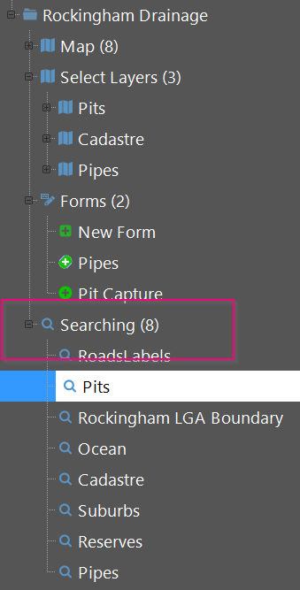
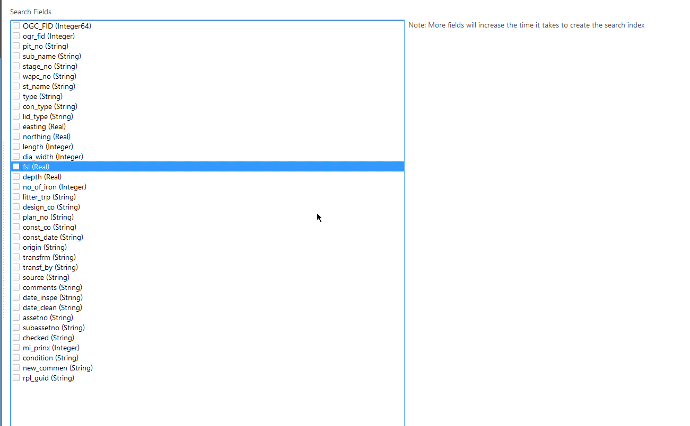

Config searching using the search tab in `Roam Config Manager` and selecting the layer to enable for searching.

You may have as many columns that you need per column. 

**Note: More columns will require longer index build times**

The search index will be created on each project load and can be rebuilt in the UI if needed. Index building is done in 
the background doesn't block in the main Roam interface on the user.

