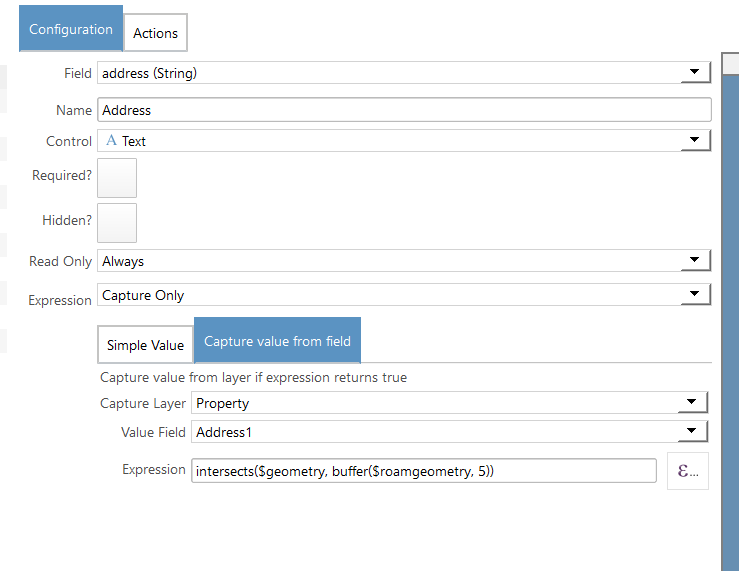

## Updating fields using values from other layers

When creating a new feature in Roam you can pull values from another layers using a default expression on the field.

Setup the default expressions using the config manager

- Open Config Manager
- Select the Project and Form
- Select the field
- Update the expression tab to be `Capture value from field`
- Set the **Capture Layer** to the layer to take the value from
- Set the ** Value Field** to the field which has the value you need
- Set the **Expression** to a QGIS expression that will test if to return the value or not

## Common Expressions

- ``intersects($geometry, buffer($roamgeometry, 5))``
- ``within($geometry, buffer($roamgeometry, 5))``

`$roamgeometry` is a reference to the currently selected feature when the expression is run.  This is the feature
being edited or created when the form is opened.

### How it works

When Roam creates a new feature the expression is tested against every feature within view to see if the expression 
will match. 

**Note: The first matching feature is used for the value and there is currently no UI control to pick other values**
