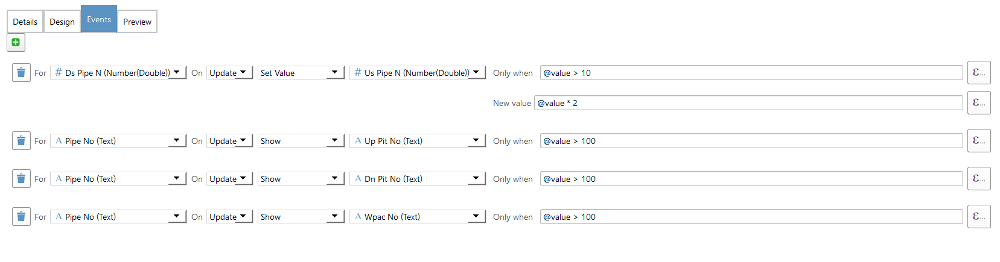

**Form Events**

Roam is able to trigger another action on when widget is updated on the form .  These are known as form events and allow you to tie values on the form together.

The events currently supported by Roam widgets on forms are:

- On **Update** - Event is fired when the widget on the right changes value.

Actions that can be taken are:

*Note: All actions apply to the widget on the left hand side.*

- **Set Value** - Set the value of the widget to the value set in the new value box. 
- **Show** - Show the widget on the left hand side.
- **Hide** - Hide the widget. 
- **Widget Expression** - Reevaluate the expression used on the widget on the left hand side. e.g update area field if the width or length changes.

All expressions are passed the current form values so you can react to values currently being entered in the form.

The `@value` variable is always set to the new value of the widget on the right hand side that triggered the event.

### Only When

Actions can also be set to trigger only when the **Only when** expression returns true. For example you might want to show a field when the value of the widget on the right hand side is greater then 100 `@value > 100`.  

