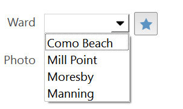
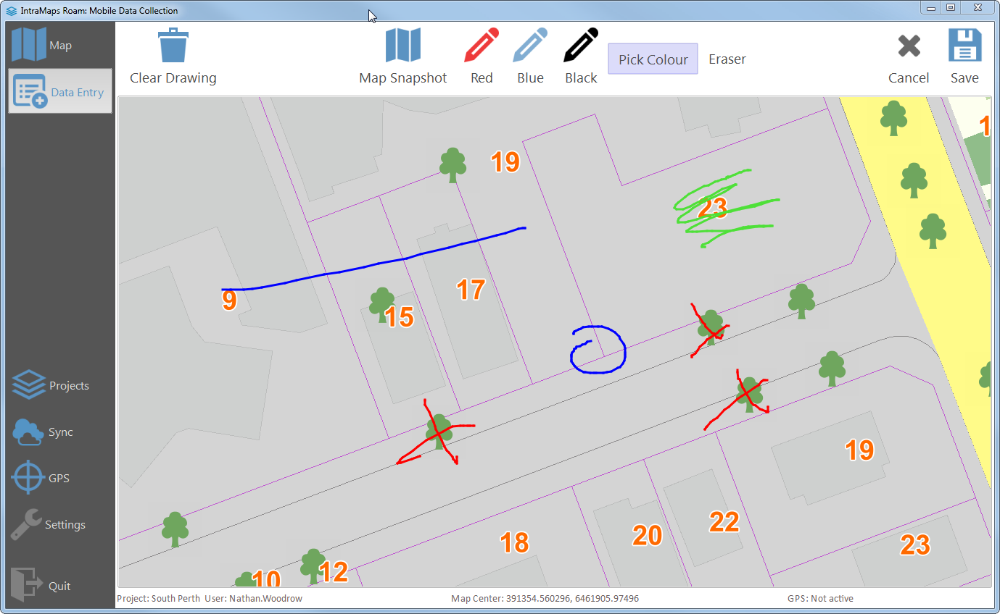
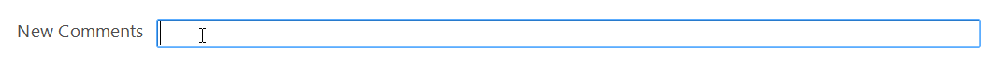
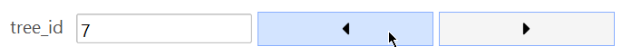
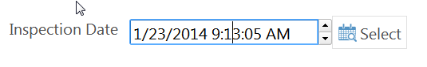
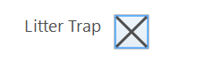
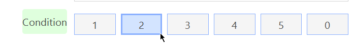

All forms in Roam are made up of widgets. Most widgets allow for data entry, some are just visual (group box, horizontal line, etc).   Each widget contains its own config section under the `config:` key. 

All widgets can be configured using the config manager. 

Supported widget types are:

 - List/Multi List
 - Option Row
 - Number/Number Double
 - Image
 - Text/TextBlock
 - Date
 - Checkbox

### List

### Image
Image widgets supports load from folder, camera capture, and drawing

**Drawing pad** 

### Text, TextBlock

### Number

### Date

### Checkbox

### Option Row
Option rows allow the user to pick one/many options using a row of buttons. Buttons can also have icons or colours

**Option row with icons**

**Normal option row**

**Normal option row**

