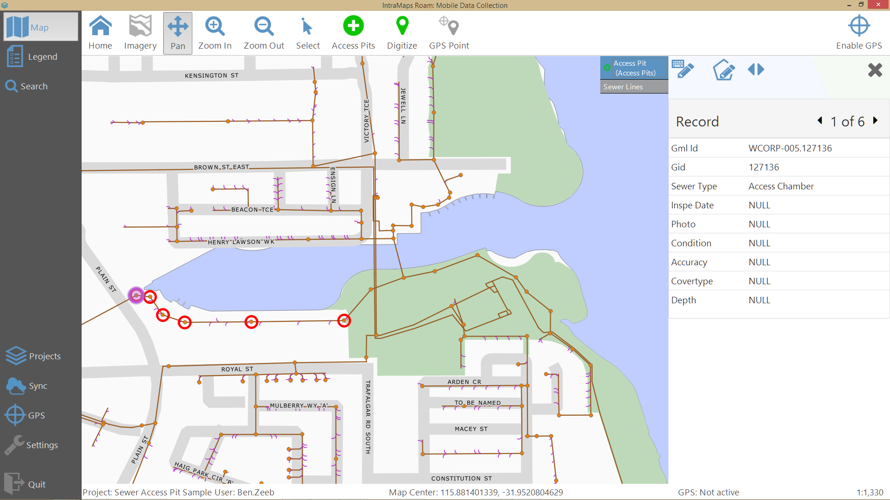
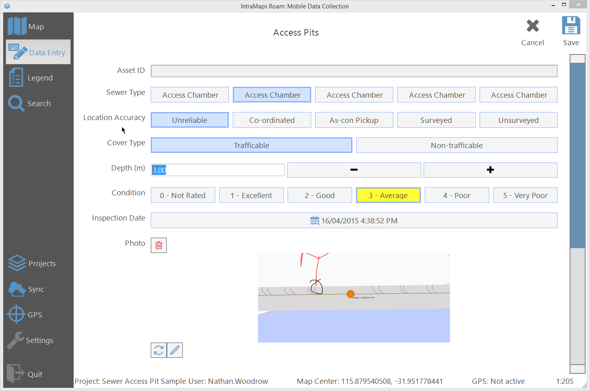

# IntraMaps Roam

[Download Release](https://github.com/DMS-Aus/Roam/releases)

[Source](https://github.com/DMS-Aus/Roam)

IntraMaps Roam is a simple data collection application built using QGIS. IntraMaps Roam is built as a standalone fully packaged Python application with everything included. QGIS is **not** required to be installed on the client machine and only on the machine that builds Roam from source.  Pre-built binary packages will be available after the first release. 

## Quick Start

- Download and install the latest [release](https://github.com/DMS-Aus/Roam/releases)
- Run `Roam Config Manager.exe`
- Create a project and some forms by following [projectadmin](admin-guide/projectadmin.md)
- Run `Roam.exe`
